<div align="center">

  # NuModem EG800

  **以 AT Command 控制與測試 4G modem 的網頁工具**

  [](changelog.md)
  [](LICENSE)
  [](#-瀏覽器支援)
  [](#-多語言支援)
  [](#-搭配的硬體nucom-eg800u)

  [**線上執行**](https://nuxtack-tw.github.io/NuModem/) · [使用說明書](doc/manual.html) · [變更記錄](changelog.md) · [回報問題](https://github.com/Nuxtack-tw/NuModem/issues)

</div>

---

## 📖 簡介

NuModem 是專為 **Quectel EG800K 系列 4G 模組**設計的 AT Command 測試工具。
自 [NuMonitor for Serial Port](https://github.com/Nuxtack-tw/NuMonitor4SerialPort) fork 而來，
移除繪圖功能、換上十個頁簽的 AT 指令面板，**把「查手冊、抄指令、猜錯誤碼」這段路整個省掉**。

> 說明書與註解的內容，全部來自 2026 年 7–9 月對實體 EG800K
> （韌體 `EG800KCNGCR07A06M04`）的實測 —— 不是照抄手冊。
> **手冊寫錯的地方文中直說。**

### ✨ 主要特色

- 💬 **指令註解模式** - 每一條送出的指令、每一行模組回來的回應，旁邊即時附上一句人話說明，**包括那些只有數字的錯誤碼**
- 🎛️ **十個頁簽的指令面板** - Hardware／Basic／Network／GNSS／TCP-IP／MQTT／WiFiScan／SSL／HTTP／FTP，170 顆按鈕
- 📝 **參數卡片** - 需要填參數的指令用卡片呈現，每格說明寫的是**本機實測範圍**而非手冊值；可直接送出，也可填回命令列自己改
- 🔗 **兩段式指令** - `AT+QISEND` 這類「先宣告長度再送資料」的指令，長度由工具自動算
- ⏱ **逾時標示** - 手冊寫的最長等待時間直接標在按鈕上，`AT+COPS=?` 要等 300 秒不是當掉
- 🛰️ **衛星頁與地圖頁** - 定位成功自動開啟，SNR 柱狀圖＋天空圖，座標畫在 OpenStreetMap 上連成軌跡
- 🚦 **RS-232 訊號狀態列** - DTR/RTS 可點擊切換（**modem 除錯必備**），DCD/DSR/CTS/RI 即時顯示
- 📖 **18 語使用說明書** - 十個頁簽裡每一組指令的工作原理與測試方式，附 21 張介面截圖
- 🌐 **18 種語言介面** - 介面文字與 AT 指令註解一起切換，支援 RTL
- 📦 **單一檔案** - 無需安裝、無建置工具，下載即可使用

---

## 🖼️ 截圖

<div align="center">
  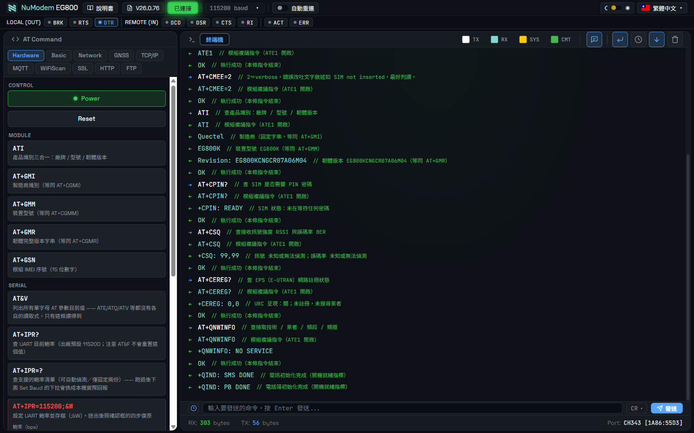
  <br><sub><b>主畫面</b>：左邊是 AT 指令面板，右邊是終端機 —— 每行後面的 <code>//</code> 就是即時註解</sub>
</div>

<div align="center">
  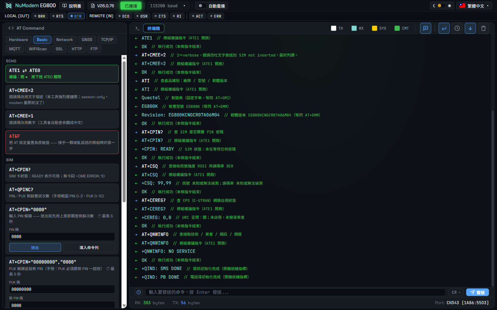
  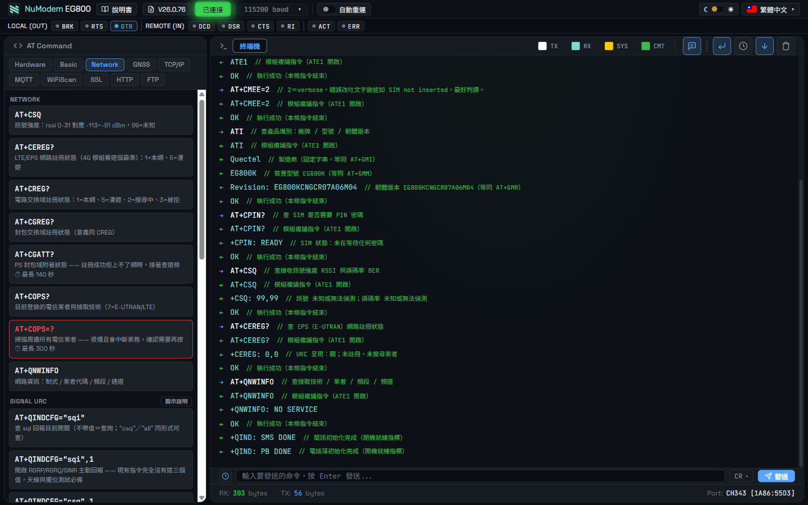
  <br><sub><b>Basic</b>：Echo／SIM／Status　／　<b>Network</b>：註冊查詢、Signal URC、PDP、診斷、射頻控制</sub>
</div>

<div align="center">
  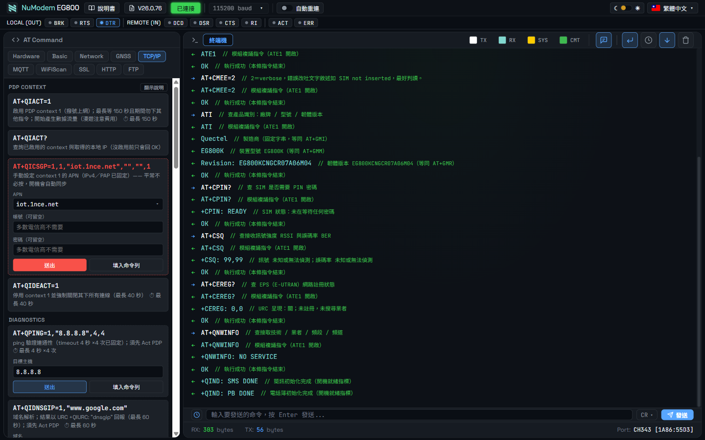
  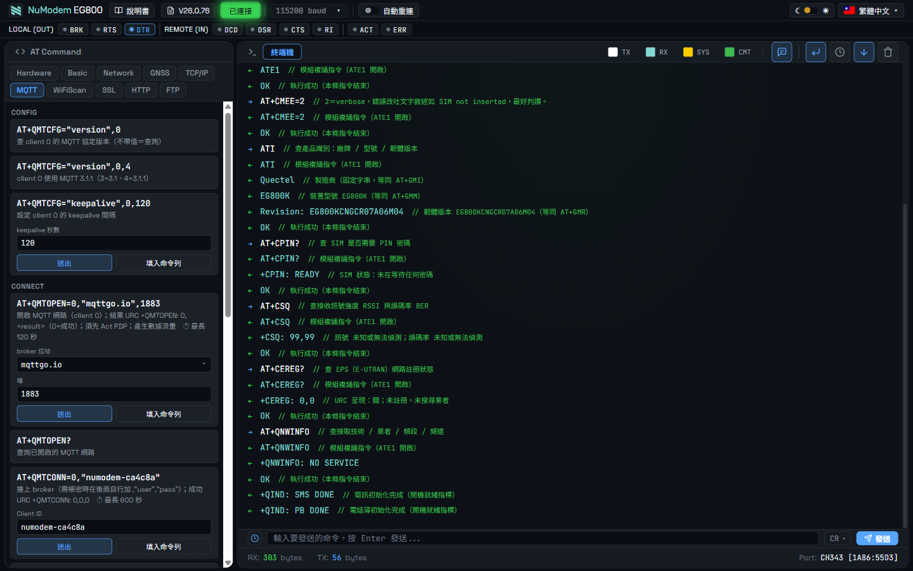
  <br><sub><b>TCP/IP</b>：PDP、socket 收送與診斷　／　<b>MQTT</b>：broker 下拉選單、訂閱與發布</sub>
</div>

<div align="center">
  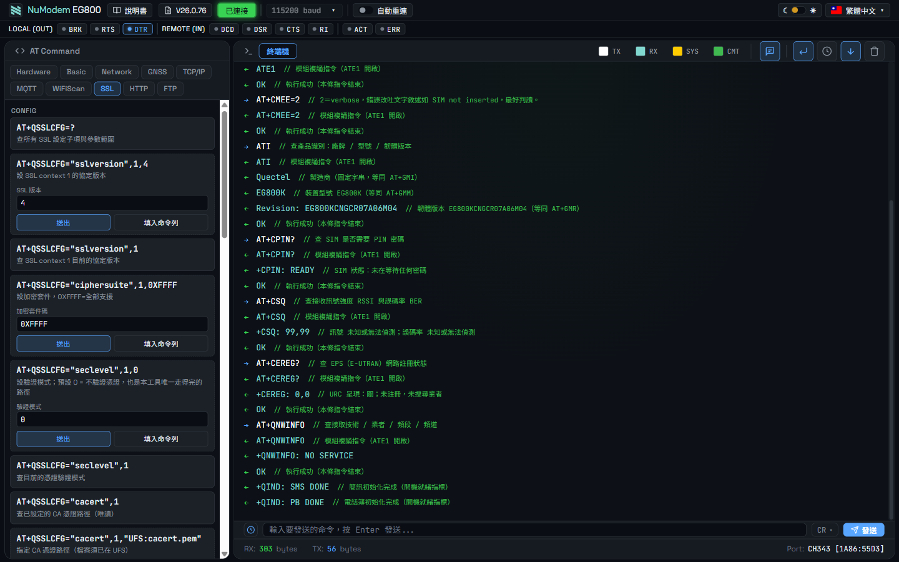
  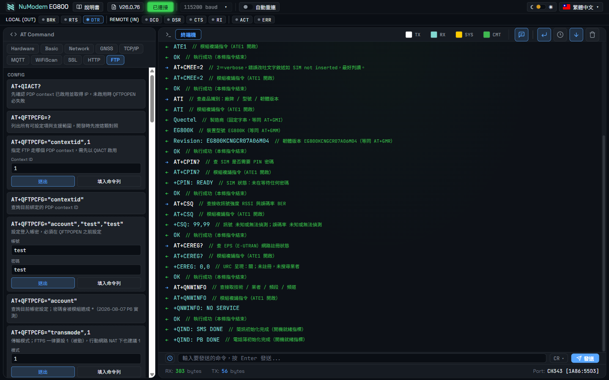
  <br><sub><b>SSL</b>：context 設定、UFS 憑證上傳、連線收送　／　<b>FTP</b>：登入、目錄與檔案管理、上傳下載</sub>
</div>

<div align="center">
  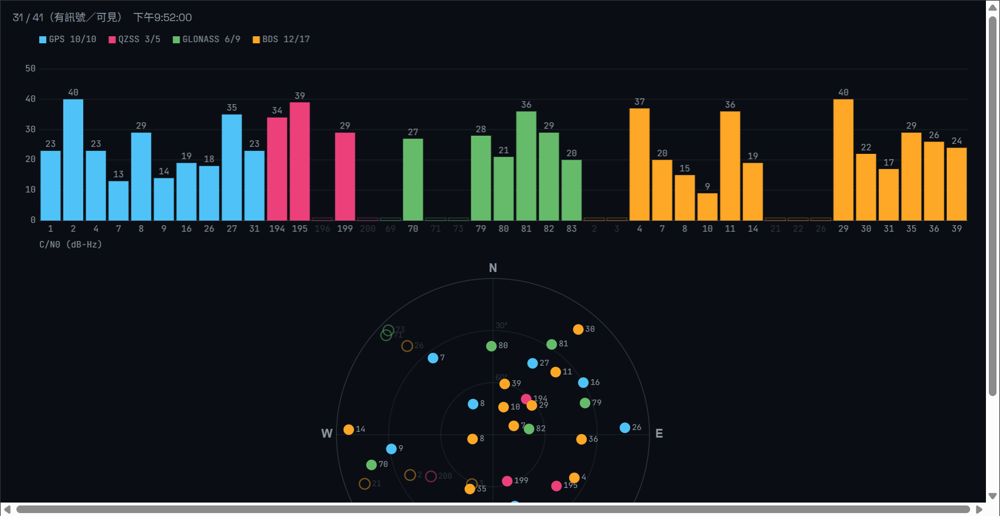
  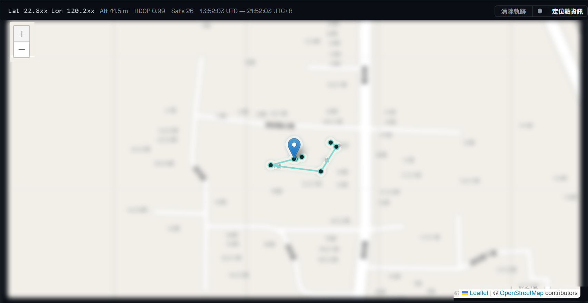
  <br><sub><b>衛星頁</b>：四星座 SNR 柱狀圖與天空圖　／　<b>地圖頁</b>：標記＝最新位置、青色線＝軌跡</sub>
</div>

<div align="center">
  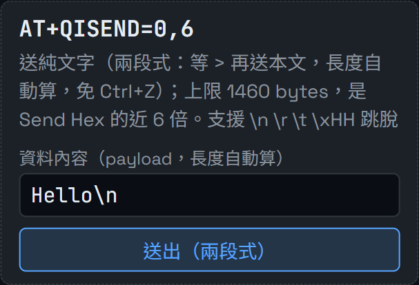
  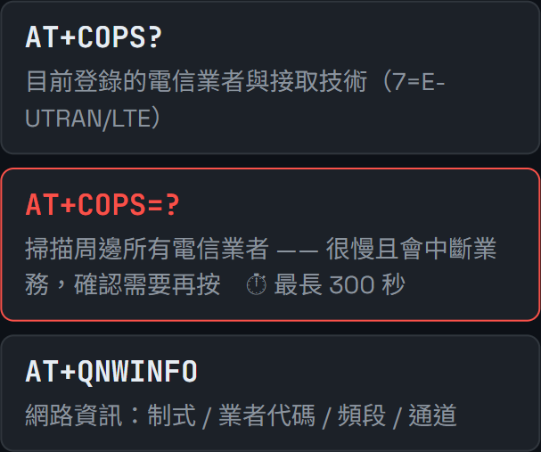
  <br><sub><b>兩段式送出</b>：<code>AT+QISEND=0,6</code> 的 6 是工具算的　／　<b>⏱ 標示</b>：手冊寫的最長等待時間</sub>
</div>

<div align="center">
  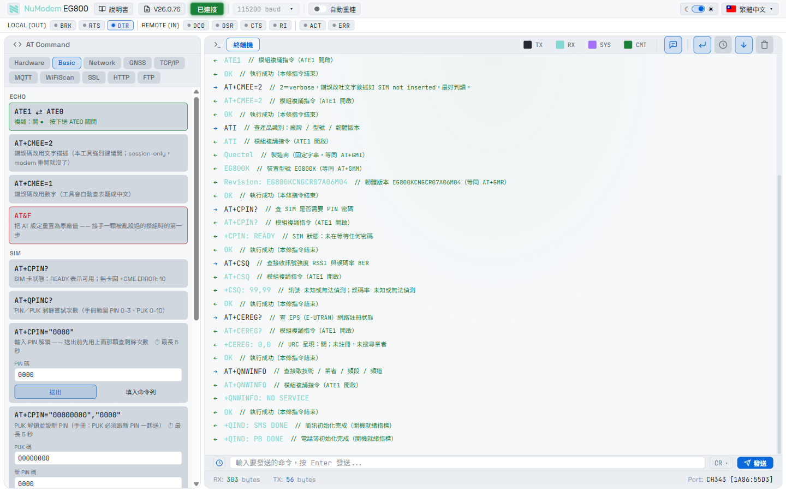
  <br><sub><b>淺色主題</b>：右上角一鍵切換，選擇記在瀏覽器裡</sub>
</div>

> 更多畫面（參數欄位說明、跳脫序列、確認框、語言選單）見[使用說明書](doc/manual.html)。

---

## 🚀 快速開始

### 1. 直接線上執行（免下載）

👉 **<https://nuxtack-tw.github.io/NuModem/>**

用 Chrome、Edge 或 Opera 打開就能用，不必下載任何檔案。

> Web Serial API 只在 **HTTPS 或 localhost** 下可用，GitHub Pages 是 HTTPS 所以沒問題。
> 注意：連接埠授權是**按網站來源記錄**的，線上版與本機版各自獨立，第一次使用要各自授權一次。

### 2. 或下載到本機使用

```bash
git clone https://github.com/Nuxtack-tw/NuModem.git
```

用 Chrome、Edge 或 Opera 開啟 `NuModem_EG800.html`。

> 直接用 `file://` 開啟也能用 Web Serial（本機檔案視為安全來源）。

### 3. 🔴 開機儀式（第一次用一定要看）

**跳過這步，模組不會回應任何 AT 指令。** 實測踩過：跳過儀式直接送 17 條指令，全部有去無回。

| 步驟 | 動作 | 為什麼 |
|---|---|---|
| 1 | 連線，**行結尾確認是 `CR`** | AT 指令必需，工具預設已是 CR |
| 2 | **DTR 打開**（燈亮） | 放開模組的 `RESET_N` |
| 3 | **RTS 走過 ON → OFF** | RTS 接的是**電源，負邏輯** —— OFF 才是通電 |
| 4 | 等終端出現 `RDY` | 開機完成，可以下指令了 |

> ⚠ **RTS 必須「走過」而不是「維持 OFF」** —— 開機脈衝是**邊緣觸發**的（見下方硬體說明），
> 電源已經通著不會有新脈衝。瀏覽器每次開啟序列埠都會重新拉高 RTS 等於斷電，
> **所以每次重新整理頁面都要重跑一次儀式**。

建議接著下 `ATE1`（確保複誦）與 `AT+CMEE=2`（verbose 錯誤，
沒開只會看到乾巴巴的 `ERROR`）—— 兩者都是 session-only，模組重開要重下。

---

## 🔌 搭配的硬體：NuCom-EG800u

工具是對著一塊自製載板開發與驗證的。**不用這塊板子也能用本工具**，
但說明書裡的實測數據都出自它。

<div align="center">
  
  <br><sub>上為元件面（模組、SIM 卡座、兩顆 u.FL 天線座），下為背面（電源與準位轉換）</sub>
</div>

<div align="center">
  <a href="hardware/NuCom-EG800u-V0.2a.pdf">
    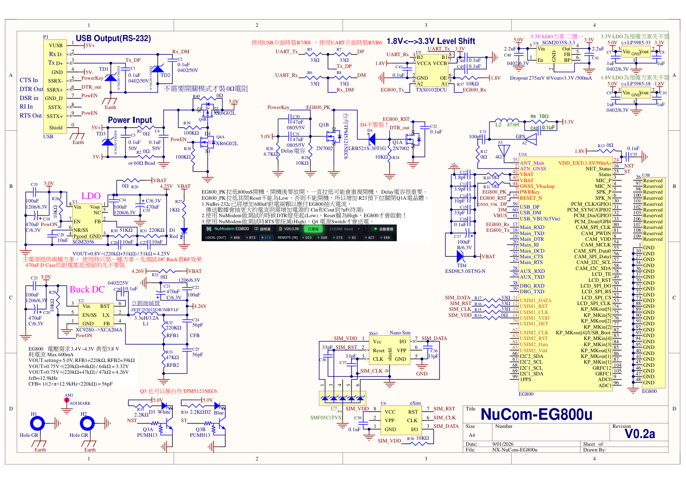
  </a>
  <br><sub><b>電路圖 V0.2a</b>（點圖開 <a href="hardware/NuCom-EG800u-V0.2a.pdf">PDF 原檔</a>）：
  左上 P1 連接器、中上準位轉換、中下 SIM 與 eSIM、右側 EG800 模組；
  左半是兩種主電源方案（Buck DC ／ LDO）擇一安裝</sub>
</div>

### 那個 USB 接頭不是 USB

板端是 **USB 3.0 Type-A 公頭**，但它**不是標準 USB 裝置** ——
接頭只是被借來當「便宜、耐插、10 接點的自訂連接器」。
USB 3.0 Type-A 有 10 個接點，跑 USB 2.0 只用得到 4 個，**剩下的 SuperSpeed 腳位全被挪去走控制線**：

| 接點 | 標準用途 | 這塊板子拿來做 |
|---|---|---|
| 1 / 4 | VBUS / GND | 供電 |
| 2 / 3 | D− / D+ | **資料** —— USB 或 UART，見下 |
| **5** | StdA_SSRX− | ★ **PowerKey**（開機） |
| **6** | StdA_SSRX+ | ★ **Reset** |
| **7 · 9** | GND_DRAIN / StdA_SSTX+ | ★ **PowerEN**（電源致能，佔兩支腳降低接觸不良風險） |
| 8 | StdA_SSTX− | 未接 |

**D+／D− 這對線還有兩種身分**：板上分岔成兩條路，只裝一組 33 Ω 串阻 ——
裝 R7/R8 直通模組的 USB 埠，裝 R5/R6 走 TXS0102 準位轉換接模組的 UART。
網路名 `Tx_DP`／`Rx_DM` 正是「Tx 或 D+、Rx 或 D−」的直白寫照。

**開機脈衝是自動的**：電源開關一導通、5 V 軌上升，上升緣經 C30／C31（47 µF ×2）
耦合到 PowerKey，產生 ≈**0.94 秒**的 `PWRKEY` 低脈衝（R25 10 kΩ × 94 µF），
正好對上模組要求的 800 ms —— 這就是開機儀式那條「RTS 要走過 ON→OFF」的由來。

> ⚠ **不能直接插進電腦的 USB 孔** —— 沒有對端拉高 PowerEN，板子根本不會通電。
> 📖 完整拆解（腳位表、偏壓分析、零件與網路 reference）見
> **[`reports/nucom-eg800u-interface-design.md`](reports/nucom-eg800u-interface-design.md)**。

| 項目 | 設計 |
|---|---|
| 模組 | Quectel **EG800**（LCC 封裝，109 pin） |
| 外型 | 隨身碟大小，整合 USB 3.0 Type-A 公頭（自訂介面，非標準 USB） |
| 頻段版本 | 絲印有 **NA / LA / EU / CN** 四格勾選標記 |
| 供電 | 5 V 進 → DC-DC buck 或 LDO **擇一安裝**，輸出約 4.25 V（模組需 3.4–4.3 V、峰值 600 mA） |
| SIM | Nano SIM 卡座 ＋ eSIM 焊盤（擇一） |
| 天線 | 兩顆 u.FL／IPEX 座：`4G LTE`（主天線）與 `GNSS` |
| 指示燈 | `Pow`（藍，5 V）／`NST`（紅，`NET_Status`）／`ST`（白，`Status`） |

電路圖：[`hardware/NuCom-EG800u-V0.2a.pdf`](hardware/NuCom-EG800u-V0.2a.pdf)
（照片為 V0.2、電路圖為 V0.2a，同一設計的相鄰改版）

---

## 📑 AT 指令面板

| 頁簽 | 涵蓋 |
|------|------|
| **Hardware** | 開機儀式、電源／重置控制、`ATI` 識別、UART 設定 |
| **Basic** | Echo（複誦與錯誤格式）、SIM（查詢與 PIN／PUK 解鎖）、Status（時鐘、電壓、網路時間） |
| **Network** | 註冊查詢、Signal URC、PDP、診斷、射頻控制 |
| **GNSS** | 開關、NMEA 讀取、定位查詢、**AGNSS 加速**（實測冷啟動 95.0 s → 51.5 s） |
| **TCP-IP** | PDP 啟動、socket 收送、`AT+QISEND` 兩段式傳輸、診斷 |
| **MQTT** | broker 下拉選單、連線、訂閱與發布 |
| **WiFiScan** | 掃描四鈕與 QuecLocator（QLBS）錯誤碼表 |
| **SSL** | context 設定、**UFS 憑證上傳**（`AT+QFUPL`）、連線收送 |
| **HTTP** | Config／Connect／Transfer／Close 四組 |
| **FTP** | 登入設定、目錄與檔案管理、上傳下載 |

> 十個頁簽裡每一組指令的**工作原理**與**測試方式**，見 [18 語使用說明書](doc/manual.html)。
> 逐冊比對官方應用手冊的覆蓋度分析在 [`reports/appnote-coverage-final-audit.md`](reports/appnote-coverage-final-audit.md)。

---

## 🌐 多語言支援

> 指的是**程式介面與 AT 指令註解**的語言，開啟後可在右上角切換，設定會自動記住。
> 使用說明書同樣有這 18 種語言。

| 語言 | 代碼 | 語言 | 代碼 |
|------|------|------|------|
| 繁體中文 | zh-TW | Türkçe | tr-TR |
| English | en-US | العربية | ar-SA |
| 日本語 | ja-JP | עברית | he-IL |
| Français | fr-FR | فارسی | fa-IR |
| Deutsch | de-DE | Русский | ru-RU |
| Italiano | it-IT | हिन्दी | hi-IN |
| Español | es-ES | Tiếng Việt | vi-VN |
| Português | pt-PT | ไทย | th-TH |
| Bahasa Melayu | ms-MY | Bahasa Indonesia | id-ID |

---

## 💻 瀏覽器支援

| 瀏覽器 | 版本 | 狀態 |
|--------|------|------|
| Google Chrome | 89+ | ✅ 推薦 |
| Microsoft Edge | 89+ | ✅ 支援 |
| Opera | 75+ | ✅ 支援 |
| Firefox | - | ❌ 不支援 |
| Safari | - | ❌ 不支援 |

> ⚠️ NuModem 使用 Web Serial API，此 API 僅在 Chromium 核心的瀏覽器上支援。

---

## 📁 專案結構

```
NuModem/
├── NuModem_EG800.html           # 主程式（單一檔案應用，版號寫在 <title>）
├── doc/
│   ├── manual.html              # 使用說明書（18 種語言，組裝產物）
│   ├── img/                     # 說明書用的介面截圖（21 張）
│   └── src/                     # 說明書建置原始碼
│       ├── build.py             #   組裝腳本，版號自動讀主程式 <title>
│       ├── check.py             #   逐語言驗結構（標籤數、id、圖片）
│       └── bodies/              #   各語言正文 —— 改文件改這裡，不要動產出檔
├── hardware/                    # 自製載板：電路圖與實體照片（CC BY-SA 4.0）
├── reports/                     # 實測記錄與設計說明
├── i18n/                        # 翻譯稿（tr/、tr2…tr18/）—— 是來源，不是產物
├── js/i18n/                     # 由 i18n/ 產生的按需載入檔（勿手改）
├── tools/                       # i18n 管線與測試輔助腳本
├── changelog.md                 # 變更記錄（唯一一份）
├── NOTICE.md                    # 版權與第三方元件聲明
├── LICENSE                      # MIT
└── LICENSE-CC-BY-SA-4.0.txt     # hardware/ 適用
```

---

## 🔧 開發

### 技術棧

- **前端**：純 HTML5 + CSS3 + JavaScript (ES6+)，無建置工具、無 npm
- **API**：Web Serial API
- **地圖**：Leaflet.js + OpenStreetMap（延遲載入，只有切到地圖頁才抓）
- **架構**：單一檔案應用程式 (SFA)

### 改說明書

```bash
# 1. 改 doc/src/bodies/manual.zh-TW.html（繁中是原始語言）
# 2. 驗證 18 種語言的結構一致
python doc/src/check.py

# 3. 組裝
python doc/src/build.py
```

### 改 AT 面板的翻譯

```bash
# 翻譯稿在 i18n/tr/、i18n/tr2/ … i18n/tr18/（後批覆蓋前批）
python tools/i18n_merge.py            # → js/i18n/at-<lang>.js
python tools/i18n_merge.py en-US      # 只重做單一語言
```

> 🔴 `i18n/tr*/` 是**來源**不是產物 —— `js/i18n/*.js` 是從它產生的。
> 詳見 [`reports/i18n-design.md`](reports/i18n-design.md) §7。

---

## 📝 版本歷史

> **版號制度**：`Va.b.c`（`a` = 西元年後兩碼、`b` = 版本釋出、`c` = 功能擴充與 bug 修正）。
> 版號的唯一來源是主程式 `<title>`。
> **完整變更記錄見 [changelog.md](changelog.md)** —— 這裡只列各版重點。

### V26.1.0 (2026-09-01) — 首次公開釋出
- 📖 說明書十個頁簽的 18 語翻譯全數完成，`check.py` 17/17
- ⚖️ 加上 MIT（程式／文件）與 CC BY-SA 4.0（`hardware/`）雙授權與 `NOTICE.md`
- 🔌 加入自製載板的電路圖、實體照片與介面設計拆解

### V26.0.80 ~ V26.0.84 (2026-08-29 ~ 08-31)
- 📖 說明書十個頁簽段落全面重寫（原本各只有 1,200–2,200 字元）
- 📤 補上 `AT+QFUPL` 檔案上傳按鈕 —— 完工盤點唯一的系統性缺口
- 🔴 更正 `+QLBS: 702` 的錯誤註解，補上官方錯誤碼表 10000–10008
- 🛰️ GNSS 段落全面改寫；修好地圖完全不顯示（Leaflet 的 `L` 被 i18n 函式遮蔽）

### V26.0.71 ~ V26.0.79 (2026-08-07 ~ 08-08)
- 📱 窄視窗版面修正
- 📖 建立 18 語說明書的組裝系統（`doc/src/`）
- 🛰️ P7 定位測試：AGNSS TTFF 對照、QuecLocator 評估

### V26.0.39 ~ V26.0.70 (2026-08-06 ~ 08-07)
- 🗺️ 終端區第三頁簽「地圖」：`AT+QGPSLOC` 座標畫在 OpenStreetMap 上
- 🌐 替 AT 面板與註解引擎建立多語系機制（1,547 條原文 × 17 語）

### V26.0.0 ~ V26.0.38 (2026-07-31 ~ 08-06)
- 🔱 自 NuMonitor for Serial Port V26.12.0 fork，移除繪圖功能
- 🎛️ 建立十個頁簽的 AT 指令面板與指令註解引擎

---

## 🤝 貢獻

歡迎提交 Pull Request 或回報問題！

1. Fork 本專案
2. 建立特性分支 (`git checkout -b feature/AmazingFeature`)
3. 提交變更 (`git commit -m 'Add some AmazingFeature'`)
4. 推送到分支 (`git push origin feature/AmazingFeature`)
5. 開啟 Pull Request

> 改說明書請改 `doc/src/bodies/`，不要動產出的 `doc/manual.html`。

---

## 📄 授權

| 範圍 | 授權 |
|---|---|
| 程式、說明書、報告、翻譯 | **[MIT](LICENSE)** |
| **[`hardware/`](hardware/)** 電路圖與照片 | **[CC BY-SA 4.0](LICENSE-CC-BY-SA-4.0.txt)** |

分開的理由：MIT 條文寫的是「the Software」，套在電路圖上不精準。

⚠ Quectel 官方 AT 指令手冊與應用筆記**不隨本專案發佈** —— 那是移遠通信的版權文件，
請自 [Quectel 官網](https://www.quectel.com/)取得。第三方元件的授權逐項見 **[NOTICE.md](NOTICE.md)**。

---

## 🙏 致謝

- [Leaflet.js](https://leafletjs.com/) - 地圖函式庫
- [OpenStreetMap](https://www.openstreetmap.org/) - 地圖圖資
- [JetBrains Mono](https://www.jetbrains.com/lp/mono/) - 等寬字體
- [Quectel](https://www.quectel.com/) - EG800K 模組與技術文件

---

<div align="center">

  **Made with ❤️ by [Nuxtack](https://github.com/Nuxtack)**

  ⭐ 如果這個專案對您有幫助，請給我們一顆星！

</div>
