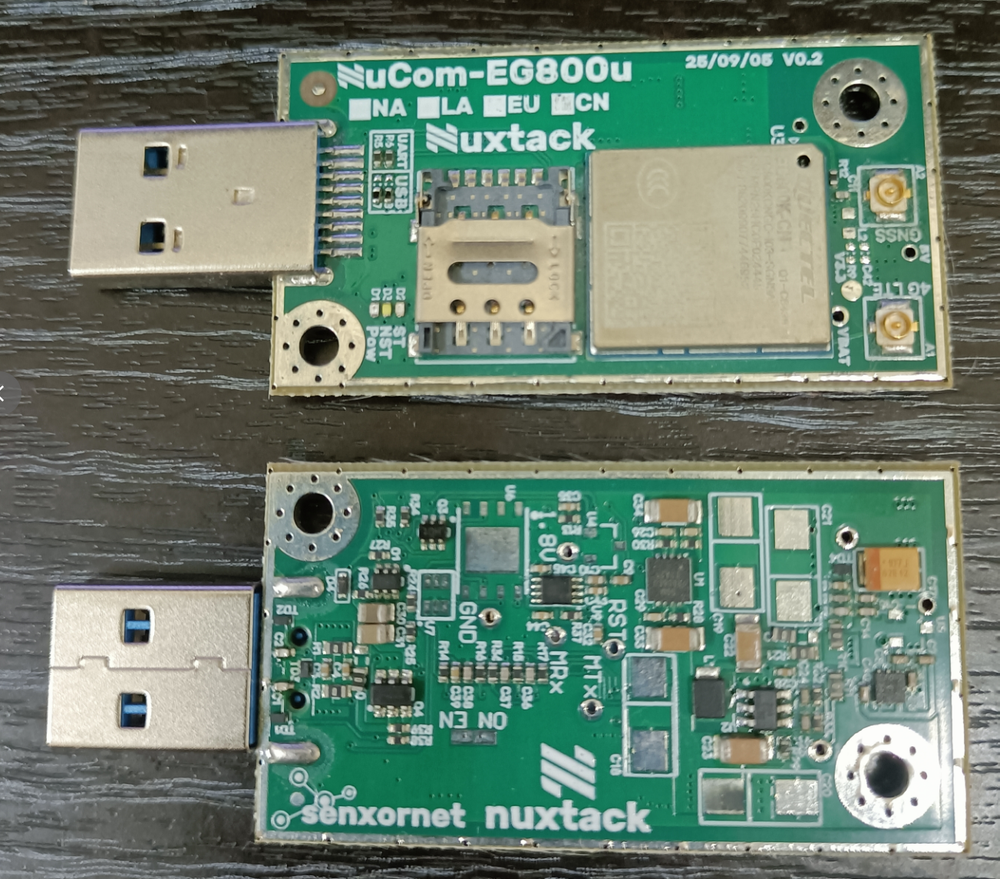

# NuModem EG800

以 **AT Command 控制與測試 4G modem**（Quectel EG800K 系列）的網頁工具。
單一 HTML 檔案、基於 Web Serial API，於 Chrome / Edge / Opera 直接開啟即可使用。

### ▶ 線上執行：**<https://nuxtack-tw.github.io/NuModem/>**

不必下載、不必安裝 —— 開網頁就能連上模組。
（Web Serial 需要 HTTPS 或 `file://`，GitHub Pages 兩者都滿足；
也可以把 `NuModem_EG800.html` 存到本機雙擊開啟，功能完全相同。）

自 [NuMonitor for Serial Port](https://github.com/Nuxtack-tw/NuMonitor4SerialPort) V26.12.0 fork，
移除繪圖功能；保留終端機、RS-232 訊號狀態列（modem 除錯必備的 DTR/RTS/DCD/DSR/CTS/RI）、
智慧連線、指令歷史、18 語言介面、深/淺雙主題。行尾預設 **CR**（AT 指令必需）。
另備 AT 指令快捷面板（Hardware / Basic / Network / GNSS / TCP-IP / MQTT / WiFiScan / SSL / HTTP / FTP
十個頁簽）與**指令註解模式** —— 每一條送出的指令、每一行模組回來的回應，
旁邊都即時附上一句人話說明，包括那些只有數字的錯誤碼。

## 搭配的硬體：NuCom-EG800u

工具是對著一塊自製載板開發與驗證的。
不用這塊板子也能用本工具，但說明書裡的實測數據都出自它。

*上為元件面（模組、SIM 卡座、兩顆 u.FL 天線座），下為背面（電源與準位轉換）。*

### 那個 USB 接頭不是 USB

板端是 **USB 3.0 Type-A 公頭**，但它**不是標準 USB 裝置** ——
接頭只是被借來當「便宜、耐插、10 接點的自訂連接器」。

USB 3.0 Type-A 有 10 個接點，跑 USB 2.0 只用得到 4 個，
**剩下的 SuperSpeed 腳位全被挪去走控制線**：

| 接點 | 標準用途 | 這塊板子拿來做 |
|---|---|---|
| 1 / 4 | VBUS / GND | 供電 |
| 2 / 3 | D− / D+ | **資料** —— USB 或 UART，見下 |
| **5** | StdA_SSRX− | ★ **PowerKey**（開機） |
| **6** | StdA_SSRX+ | ★ **Reset** |
| **7 · 9** | GND_DRAIN / StdA_SSTX+ | ★ **PowerEN**（電源致能，佔兩支腳降低接觸不良風險） |
| 8 | StdA_SSTX− | 未接 |

**更巧的是 D+／D− 這對線有兩種身分**：板上分岔成兩條路，只裝一組 33 Ω 串阻 ——
裝 R7/R8 就直通模組的 USB 埠（USB 模式），裝 R5/R6 就走 TXS0102 準位轉換
接到模組的 UART（UART 模式）。網路名 `Tx_DP`／`Rx_DM` 正是「Tx 或 D+、Rx 或 D−」的直白寫照。

⚠ **所以不能直接插進電腦的 USB 孔** —— 沒有對端拉高 PowerEN，板子根本不會通電。
必須搭配對應的轉接板（NuBri-232c）使用。

> 📖 完整拆解（電源開關的偏壓、開機脈衝為什麼是 0.94 秒、三條控制線的先後順序）
> 見 **[`reports/nucom-eg800u-interface-design.md`](reports/nucom-eg800u-interface-design.md)**。

- 📄 電路圖：[`hardware/NuCom-EG800u-V0.2a.pdf`](hardware/NuCom-EG800u-V0.2a.pdf)
- 📷 照片為 **V0.2**，電路圖為 **V0.2a**（同一設計的相鄰改版）

| 項目 | 設計 |
|---|---|
| 模組 | Quectel **EG800**（LCC 封裝，109 pin） |
| 外型 | 隨身碟大小，板端整合 USB 3.0 Type-A 公頭（**自訂介面，非標準 USB**）；兩個角落有帶接地環的固定孔 |
| 頻段版本 | 絲印有 **NA / LA / EU / CN** 四格勾選標記，照片這片是 CN |
| 供電 | 5 V 輸入 → 主電源**兩種方案擇一安裝**：DC-DC buck 或 LDO，輸出約 **4.25 V**（EG800 需 3.4–4.3 V、典型 3.8 V、峰值 600 mA）。先裝 buck 測 RF 表現 |
| 週邊電源 | 3.3 V：SGM2035S-3.3（壓差 275 mV @ 500 mA）；1.8 V 取自模組的 `VDD_EXT`（50 mA），另留 LP3985 備援位置 |
| 主機介面 | 同一對 D+/D− 線**兩用**，靠 33 Ω 串阻選路：R7/R8 → 模組 USB 埠；R5/R6 → **TXS0102**（3.3 V ↔ 1.8 V）→ 模組 UART。兩組互斥，只能裝一組 |
| 控制線 | Reset、PowerKey、PowerEN 三條走接頭的 SuperSpeed 腳位，全部經 MOSFET **反相**後才進模組 |
| SIM | Nano SIM 卡座 ＋ eSIM 焊盤（擇一），SIM 線加 SMF05C TVS |
| 天線 | 兩顆 **u.FL／IPEX** 座，絲印標 `4G LTE`（A1，主天線）與 `GNSS`（A2，含 π 型匹配 ＋ 47 nH） |
| 保護 | 4 顆 ESD9L5.0ST5G-N 分佈於 USB／UART／電源 |
| 指示燈 | 絲印 `Pow`／`NST`／`ST` 三顆：藍 = 5 V 電源、紅 = `NET_Status`、白 = `Status` |

### 為什麼 RTS 是電源、DTR 是 Reset

這不是軟體的怪癖，是**接線就是這樣**：

- **RTS → 接頭 pin 7/9 → `PowEN` → Q4（XR6G02L，單封裝 N+P）高側電源開關**。
  R38 100 kΩ 把 `PowEN` 下拉到地，所以**預設不通電**；拉高才導通。
  而 RS-232／邏輯準位的 RTS **解除觸發時線上是高電位** ——
  UI 上「RTS 按滅」＝ 線路拉高 ＝ 送電。負邏輯的由來就在這裡。
- **DTR → 接頭 pin 6 → Q1A（2N7002）→ 模組 `RESET_N`**，中間**反相**了一級。
  DTR 觸發（低）→ Q1A 關 → `RESET_N` 放開 → 模組才跑得起來。

**第三步不用你操作** —— 這是整個設計最漂亮的地方：

> 電源開關一導通、5 V 軌上升，那個**上升緣經 C30／C31 兩顆 47 µF 耦合到 `PowerKey`**，
> 把 Q1B 打開、把模組的 `PWRKEY` 拉低；電容經 R25 10 kΩ 充飽後自動回落。
> 脈寬 ≈ 10 kΩ × 94 µF ≈ **0.94 秒**，正好對上模組要求的「拉低 800 ms 開機」。

所以**送電本身就會觸發開機**。電路圖註記說的「delay 電容很重要」「一直拉低可能重複開機」
講的就是這顆 RC —— 電容太小脈衝不夠長開不了機，不會自動回落則會反覆重開。

也因此**順序不能顛倒**：要先放開 Reset（DTR），再送電（RTS）。
反過來的話，開機脈衝發生時模組還壓在重置裡，那個脈衝就白費了 ——
這正是註記「`EG800_PK` 拉低期間 Reset 不能為 Low」在講的事。

模組瞬間電流大（峰值 600 mA，傳送數據更高），
配套的 NuBri-232c 已加兩顆 680 µF 鉭電；本板另預留多顆 470 µF 位置。

## 說明書

**[`doc/manual.html`](doc/manual.html) —— 18 種語言。** 從打開網頁、接上模組、跑開機儀式，
一路到十個頁簽裡每一組 AT 指令的**工作原理**與**測試方式**，附 21 張介面截圖。
主程式 Header 的「說明書」按鈕會把目前介面語言帶過去。

內容全部來自 2026 年 7–8 月對實體 EG800K（韌體 `EG800KCNGCR07A06M04`）的實測，
不是照抄手冊 —— **手冊寫錯的地方文中直說**。

> 說明書是組裝產物，要改內容請改 `doc/src/bodies/`，見 [`doc/src/README.md`](doc/src/README.md)。

## 開機儀式（第一次用一定要看）

RTS 接的是**模組電源，負邏輯 —— RTS OFF 才是通電**；DTR 接的是 Reset
（硬體上為什麼這樣接，見上面〈搭配的硬體〉）。
瀏覽器每次打開序列埠都會重新拉高 RTS，等於**斷電**，所以
**每次重新整理頁面之後都要重跑一次開機儀式**，否則模組不會回應任何 AT 指令。
完整程序見說明書〈開機儀式〉一節。

## 其他

硬體參考資料（Quectel 官方 AT 指令手冊 v1.4 與 17 份應用筆記）**不隨本專案發佈** ——
那是移遠通信的版權文件，請自 [Quectel 官網](https://www.quectel.com/)取得。
文中引用時一律標明冊名與版本，不附檔案。詳見 [`NOTICE.md`](NOTICE.md)。

執行期會用到的第三方資源（Leaflet、OpenStreetMap 磚圖、Google Fonts、flagcdn）
與各自的授權條款，同樣列在 [`NOTICE.md`](NOTICE.md) §4。
拔掉網路時只有地圖與國旗圖示不可用，**序列埠通訊與 AT 面板完全正常**。

變更記錄見 [`changelog.md`](changelog.md)，實測記錄見 `reports/`。

## 授權

依內容型態分兩種：

| 範圍 | 授權 |
|---|---|
| 程式、說明書、報告、翻譯 | **[MIT](LICENSE)** —— 自由使用修改散布，含商用，保留版權聲明即可 |
| **[`hardware/`](hardware/)** 電路圖 | **[CC BY-SA 4.0](LICENSE-CC-BY-SA-4.0.txt)** —— 同樣可商用，但需**姓名標示**且改作須**相同方式分享** |

分開的理由：MIT 條文寫的是「the Software」，套在電路圖上不精準。

⚠ 以上只涵蓋本專案自行撰寫的內容。Leaflet、OpenStreetMap 磚圖、Google Fonts
等第三方素材各有授權，fork 時義務照樣要遵守 —— 逐項見 [`NOTICE.md`](NOTICE.md)。
